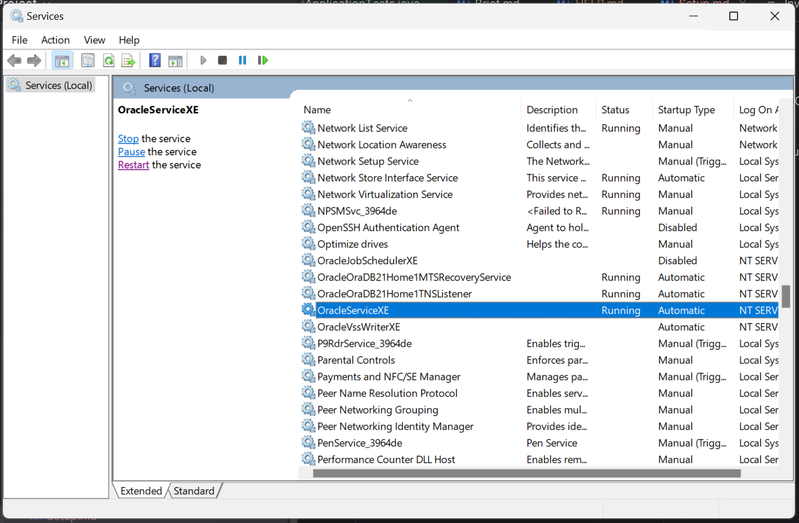

## Oracle DB
Download and install Oracle SQL Developer and Oracle XE

`win + R` - launch Run dialog  

Search for `services.msc`  

Ensure OracleServiceXE and OracleOraDB21Home1TNSListener are running

## Lombok
Adding @Getter and @Setter annotations to entities caused issues with serialisation frameworks like Jackson.  
Better to use explicit getter/setter methods