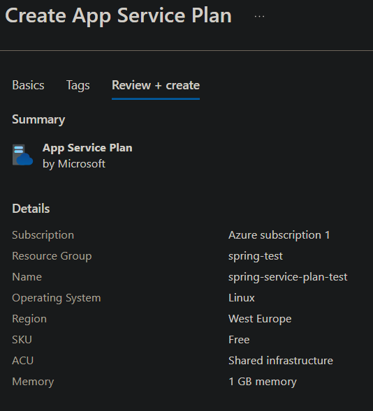

# Spring Boot Azure

# Resource Group
A resource group is a container that holds related resources for an Azure solution. It allows you to manage and organize your resources in a logical way. You can create, update, and delete resources in a resource group as a single unit.

When you create a resource group, you specify a name and a region. The region determines where the resources in the group will be located. You can choose from various regions around the world, such as East US, West Europe, Southeast Asia, etc.

```
Subscription
 └── Resource Group (backend-prod)
      ├── App Service
      ├── Azure SQL
      ├── Storage Account
      └── Application Insights
```

# Azure App Service
Azure App Service is a fully managed platform (PaaS) for building, deploying, and scaling web applications. It supports multiple programming languages, including Java, and provides features such as auto-scaling, high availability, and integrated monitoring.

It is an HTTP-based service for hosting web applications, REST APIs, and mobile backends. It offers a range of features to help you build and deploy your applications quickly and easily.

**App Service Plans** - An App Service Plan defines the region, features, cost, and compute resources associated with your web app. You can choose from different pricing tiers based on your application's needs.

* Region (e.g., East US, West Europe)
* Number of VM instances
* Size of VM instances (e.g., Small, Medium, Large)
* Features (e.g., custom domains, SSL, auto-scaling)
* Pricing Tier (e.g., Free, Shared, Basic, Standard, Premium)




 
