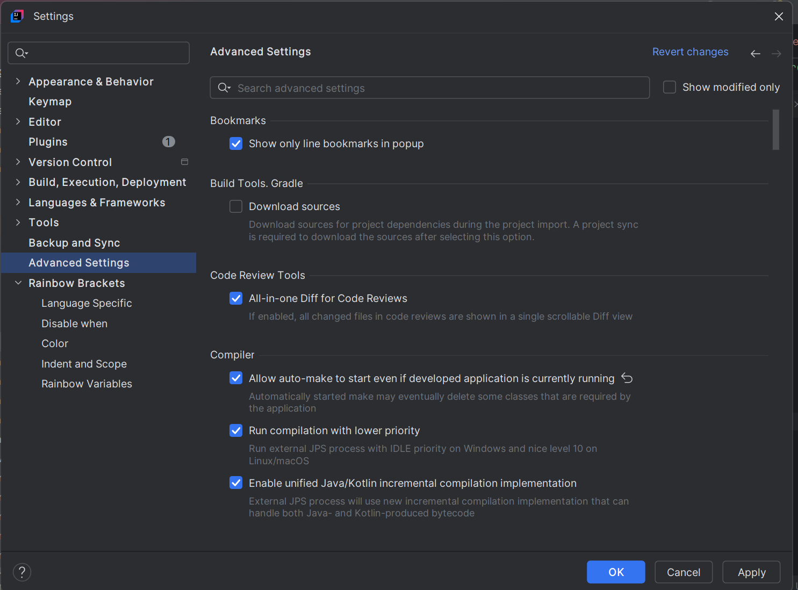
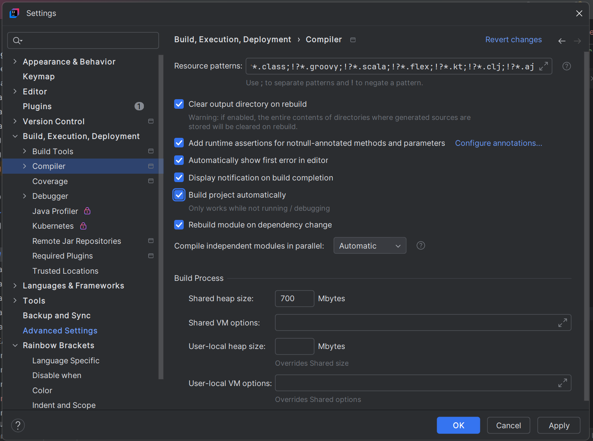

## Profiles
```properties
// application.properties

spring.profiles.active=dev
```

```properties
// application-dev.properties

username=dev-username
password=dev-password
```

```properties
// application-sit.properties

username=sit-username
password=sit-password
```

## application.proprties
`server.port=8081` sets port to 8081 instead of default 8080

## Logging
```properties
logging.level.org.springframework=INFO
logging.level.org.springframework=DEBUG
logging.level.org.springframework=WARN
```

### Log4j
```xml
<!-- Add Spring Boot Log4j2 Starter -->
<dependency>
    <groupId>org.springframework.boot</groupId>
    <artifactId>spring-boot-starter-log4j2</artifactId>
</dependency>
```
```xml
// src/main/resources/log4j2.xml

<?xml version="1.0" encoding="UTF-8"?>
<Configuration status="WARN">
    <Appenders>
        <!-- Console Appender -->
        <Console name="Console" target="SYSTEM_OUT">
            <PatternLayout pattern="%d{yyyy-MM-dd HH:mm:ss} %-5p %c{1}:%L - %m%n" />
        </Console>

        <!-- File Appender -->
        <File name="File" fileName="logs/app.log">
            <PatternLayout pattern="%d{yyyy-MM-dd HH:mm:ss} %-5p %c{1}:%L - %m%n" />
        </File>
    </Appenders>

    <Loggers>
        <!-- Root Logger -->
        <Root level="info">
            <AppenderRef ref="Console" />
            <AppenderRef ref="File" />
        </Root>

        <!-- Custom Logger -->
        <Logger name="com.example" level="debug" additivity="false">
            <AppenderRef ref="Console" />
        </Logger>
    </Loggers>
</Configuration>

```
```java
import org.apache.logging.log4j.LogManager;
import org.apache.logging.log4j.Logger;

private static final Logger logger = LogManager.getLogger(CLASSNAME.class);
```
## DevTools
### Auto-restart
```xml
<dependency>
    <groupId>org.springframework.boot</groupId>
    <artifactId>spring-boot-devtools</artifactId>
    <scope>runtime</scope>
    <optional>true</optional>
</dependency>
```




DevTools will be disabled automatically when running application as a packaged JAR in production!